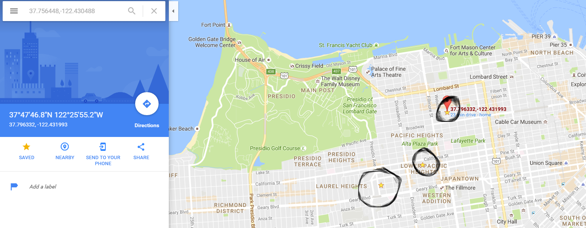
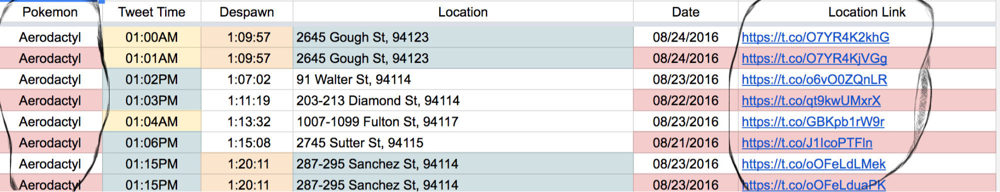
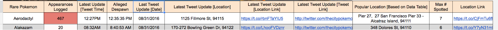
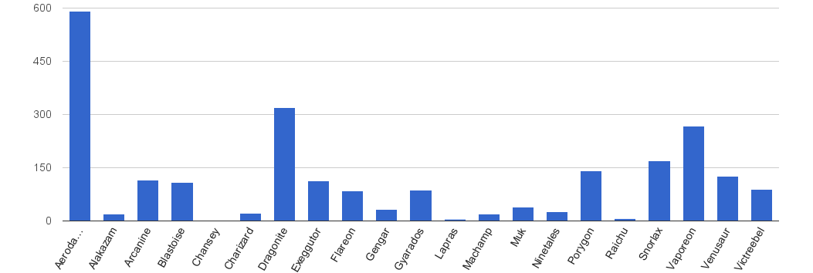

# Rare-Pokemon-Sightings

Main Spreadsheet: [http://goo.gl/BAaAgF](https://www.google.com/url?q=http://goo.gl/BAaAgF&sa=D&ust=1583912733906000) 

Feedback: [https://goo.gl/forms/01f2k7DhbL04lf8r2](https://www.google.com/url?q=https://goo.gl/forms/01f2k7DhbL04lf8r2&sa=D&ust=1583912733906000)

Pokemon Go - Rare Pokemon Sightings (SF)

1\. About

I really wanted something that can reliably present useful spawn data so I would know where I should go instead of wasting an entire afternoon and evening wandering for these specifically rare critters without knowing where they are relatively located throughout the week, in spite of the new Nearby feature. As a Pokedex Holder at a legitimate 721 entries across several generations from Red alongside my completionist motivation over the years, being so close at finding them all [Kanto] in my favorite franchise is quite irksome to me. Especially, knowing that there are rumors of certain locations at certain times translate to there is a pattern that we could probably derive. Snorlax at Stow Lake? Really? When?

There was also a reddit thread not too long ago that pointed out the twitter @thecitypokemon by the user ‘/u/leaguesleagues’, however, I did not make the spreadsheet because of that thread. (I actually did not check /r/PokemonGoSF during that time but that user’s thread gets an honorable link in my sheets) A friend actually mentioned that there was a twitter that announced this.

1.1 Tweets

Everything is automated using functions. However, there is a huge time delay per data entry - refer to the twitter @thecitypokemon if you are actually searching for rare Pokemon or the "Pokemon, time, location, date" sheet to see the most recent entry (The latest tweet update cells have a delay in its update as well). Otherwise, do use these sheets to gauge a pattern approximating the spawn radius and times, especially since these rare Pokemon do not have a designated nest (Unlike Squirtles at Fort Mason) or are not commonly spawned at an area (Unlike Charmanders at Rincon Park).

Yes, I am aware of duplicate tweets skewing the data, but they are not significant enough to affect most of the surface data. If necessary, one can simply omit the consecutive data manually.. I am also aware of the caveatsof this spreadsheet because it relies on 1\. Niantic Servers, 2\. @thecitypokemon Tweets, 3\. IFTTT servers, and 4\. Google Servers. Hopefully this document runs for, at the least, the next 2 months (starting from August 19th).

1.2 Certain Pokemon

From many sources and a personal anecdote - Lapras may appear at Ocean Beach between 3pm-5pm near the Cliff House / Ocean Beach area. I personally caught a Lapras at 3:40pm at the Cliff House on a Wednesday after several rumors of Lapras’ spawning near Beach Chalet (on Aug-17-2016)] but do take note that your mileage may vary, especially if Niantic changes their spawns!

1.3 Other Cities

Because I’ve used simple simple functions to process each tweet into different elements/cells, it is actually possible to replicate this spreadsheet for another city, provided that every tweet follows a specific format with a location link (Preferably Google Maps or any Mapping service where you can save coordinates/locations)

1.4 Special Thanks

All special thanks and everyone who have contributed in some significant way are listed on the “Special Thanks” sheet.

* * *

2\. Map Links

Luckily these tweets have a location link for us to follow. So for all location links, click "Save" to each of your desired Pokemon's Google Map link. It is also recommended to look for the links in the "Sorted Data" sheet!

2.1 Mapping Example

Example of utilizing the location links which may help approximate an area of these non-specific nests for your hunt via multiple "stars" populated on your map. To remove the saved link, click on the star and click the "saved" icon. Remember to watch your surroundings when you do go to these locations and try to hunt during the daytime!

  
I chose 3 random locations out of several for this Pokemon but you can almost approximate the general spawn area. Do note that there may be outliers, spawn locations may change over time due to Niantic updates, and a correlation does not necessarily mean a causation.

  
From the “Sorted Data” sheet - You can easily click on each Pokemon’s location link that you are choosing to track. The table is sorted automatically by Name, Date, and Tweet Time - for alternative sorting, you may copy the data on the Adjusted Raw Data document found via the link on section 3.1.  

2.2 Today’s Tweets

If you want to see today’s tweet data from the sorted list: On the toolbar above, Click "Data", "Filter View" on the dropdown, then click "Today". Click "None" to exit filtered view (“None” onlyappears on the dropdown menu once you enter filter view).          
*All tweets are based on SF’s local time (Pacific Time)  

  

2.3 Home Table

The table on the Home sheet can be used to find the latest (updated live - with time delay) Pokemon with their respective location links. In addition, you may also find see the location that a Pokemon has been often sighted all based on the Data Table sheet.

Rare Pokemon: The name of the Pokemon

Appearances Logged: The number of this Pokemon was tweeted and logged in the data

Latest Update Tweet Time: The most recent time this Pokemon was tweeted and logged in the data.

Alleged Despawn: The time that this Pokemon is supposed to despawn (Extracted from the Tweet)

Last Tweet Update Date: Most recent date that this Pokemon was Tweeted - Can help understand the Tweet and spawn frequency of the Pokemon based on the Date of Tweet

Latest Tweet Update Location: Location extracted from the Tweet.

Latest Tweet Update Location Link: The link provided and extracted from the Tweet

Latest Tweet Update Tweet Link: A direct link to the tweet (For record purposes)

Popular Location: The location of this Pokemon that has often tweeted at. (Extracted from the Data Table analyzing the Tweet. If multiple, based on the most recent [furthest down] location)

Max # Spotted: The total number of this Pokemon was sighted

Location Link: Link to the location

* * *

3\. Charts

Bar Graph

")

3D Pie Chart

What are some basic conclusions that we could draw from these statistics? Out of all the tweets, there is a high proportion of Aerodactyl spawns tweeted compared to the other rare Pokemon in San Francisco ever since these tweets were logged or San Francisco is the place to be if one wants to look for an Aerodactyl (after approximating the Pokemon’s general spawn radius and time range). OR perhaps that Twitter account has a bias with [average number of Aerodactyl] Aerodactyl tweets.

*I do understand that all locations may change over time and a correlated pattern does not necessarily mean a fact.

3.1 Adjusted Raw Data Document

[http://goo.gl/8VPorh](https://www.google.com/url?q=http://goo.gl/8VPorh&sa=D&ust=1583912733853000)

Do refer to this document if you would like to do further analysis, it will continue to collect data unless it runs out of rows. Please note that this document has time and dates converted a numerical value.

* * *

4\. Excel

Just some stuff here, do continue scrolling on.

4.1 Functions used

<table class="c33">

<tbody>

<tr class="c9">

<td class="c43" colspan="4" rowspan="1">

Functions

</td>

</tr>

<tr class="c5">

<td class="c13" colspan="1" rowspan="1">

=

</td>

<td class="c13" colspan="1" rowspan="1">

+

</td>

<td class="c13" colspan="1" rowspan="1">

-

</td>

<td class="c13" colspan="1" rowspan="1">

<>

</td>

</tr>

<tr class="c5">

<td class="c13" colspan="1" rowspan="1">

image

</td>

<td class="c13" colspan="1" rowspan="1">

if

</td>

<td class="c13" colspan="1" rowspan="1">

average

</td>

<td class="c13" colspan="1" rowspan="1">

sum

</td>

</tr>

<tr class="c5">

<td class="c13" colspan="1" rowspan="1">

count

</td>

<td class="c13" colspan="1" rowspan="1">

countif

</td>

<td class="c13" colspan="1" rowspan="1">

counta

</td>

<td class="c13" colspan="1" rowspan="1">

countifs

</td>

</tr>

<tr class="c5">

<td class="c13" colspan="1" rowspan="1">

left

</td>

<td class="c13" colspan="1" rowspan="1">

unique

</td>

<td class="c13" colspan="1" rowspan="1">

index

</td>

<td class="c13" colspan="1" rowspan="1">

right

</td>

</tr>

<tr class="c5">

<td class="c13" colspan="1" rowspan="1">

match

</td>

<td class="c13" colspan="1" rowspan="1">

find

</td>

<td class="c13" colspan="1" rowspan="1">

search

</td>

<td class="c13" colspan="1" rowspan="1">

arrayformula

</td>

</tr>

<tr class="c5">

<td class="c13" colspan="1" rowspan="1">

and

</td>

<td class="c13" colspan="1" rowspan="1">

text

</td>

<td class="c13" colspan="1" rowspan="1">

transpose

</td>

<td class="c13" colspan="1" rowspan="1">

concatenate

</td>

</tr>

<tr class="c5">

<td class="c13" colspan="1" rowspan="1">

now

</td>

<td class="c13" colspan="1" rowspan="1">

hour

</td>

<td class="c13" colspan="1" rowspan="1">

/

</td>

<td class="c13" colspan="1" rowspan="1">

*

</td>

</tr>

<tr class="c5">

<td class="c13" colspan="1" rowspan="1">

median

</td>

<td class="c13" colspan="1" rowspan="1">

mode

</td>

<td class="c13" colspan="1" rowspan="1">

max

</td>

<td class="c13" colspan="1" rowspan="1">

min

</td>

</tr>

<tr class="c5">

<td class="c13" colspan="1" rowspan="1">

filter

</td>

<td class="c13" colspan="1" rowspan="1">

stdev

</td>

<td class="c13" colspan="1" rowspan="1">

len

</td>

<td class="c13" colspan="1" rowspan="1">

sort

</td>

</tr>

<tr class="c5">

<td class="c13" colspan="1" rowspan="1">

timevalue

</td>

<td class="c13" colspan="1" rowspan="1">

datevalue

</td>

<td class="c13" colspan="1" rowspan="1">

importrange

</td>

<td class="c13" colspan="1" rowspan="1">

offset

</td>

</tr>

<tr class="c9">

<td class="c43" colspan="4" rowspan="1">

Conditional Format

</td>

</tr>

<tr class="c5">

<td class="c13" colspan="1" rowspan="1">

ISEVEN(ROW())

</td>

<td class="c13" colspan="1" rowspan="1">

=countif(range,cell)>1

</td>

<td class="c13" colspan="1" rowspan="1">

ISODD(ROW())

</td>

<td class="c13" colspan="1" rowspan="1">

</td>

</tr>

</tbody>

</table>

This is not a “How to Excel” document, please refer to necessary sources if needed.

4.2 Replication

        Like I have said in 1.3 Other Cities, this type of document is perfectly replicable. Who knows, you may even make a better one than me.

* * *

5\. Other Information

        Again, this spreadsheet relies on several services to function well. Because of that, it is best to go to the source Twitter or live map applications. Do use the document, and probable derivatives (Other similar spreadsheets), for research purposes.

5.1 Services

        Of course, the two free services that I have used are IFTTT and Google [Applications]

5.1.1 IFTTT

First off, this service is simple and popular. There is an article that compares the service IFTTT versus other similar services (Zapier/Microsoft Flow) but I am not going to discuss that here - Just a simple service that I have used for a few years. (Especially during the Amiibo craze)

Do note that IFTTT polls tweets about every 10 to 30 minutes. Thus the spreadsheet document also relies on whether or not there are tweets.

I am aware of IFTTT’s 2000 row limit, my solution is to create a new spreadsheet to accommodate the new tweets collected while using an array formula to collect the new data, thus without adjusted pre-existing sheets that grabs data from the tweet data sheet (EG: Adjusted Data).

5.1.1.1 My IFTTT recipe

IFTTT recipe - If |New Tweets by @thecitypokemon|, Then |Add row to Spreadsheet|

5.1.2 Google

Seems like the obvious free choice. Everything is stored on Google’s cloud servers as well as having only one account as a “One Stop Shop” to access everything else just from your browser, including YouTube. Apologies if it seems like I am fawning over Google, it is just that they provide a reliable and accessible service.

5.1.2.1 Google Spreadsheets

All the data is grabbed from a master spreadsheet that I can easily edit at ease without touching the main spreadsheet using the =importrange(“dockey”,”sheet!range”). I do not have plans to release that document for viewing for obvious reasons (It’s a nasty playground with too many sheets). Do feel free to copy the data, as well as using the links.

Please note: All the tweet data logged have an update delay and each tweet is processed automatically.

* * *

6\. Questions and Answers

<table class="c27">

<tbody>

<tr class="c5">

<td class="c8" colspan="1" rowspan="1">

Question

</td>

<td class="c8" colspan="1" rowspan="1">

Answer

</td>

</tr>

<tr class="c5">

<td class="c8" colspan="1" rowspan="1">

Why? Why did you do this?

</td>

<td class="c8" colspan="1" rowspan="1">

See 1\. About

</td>

</tr>

<tr class="c5">

<td class="c8" colspan="1" rowspan="1">

Can I see someone else’s feedback?

</td>

<td class="c8" colspan="1" rowspan="1">

No, I have never included that option when I created the Google Form.

</td>

</tr>

<tr class="c5">

<td class="c8" colspan="1" rowspan="1">

I’ve made [this], can you add it to the main spreadsheet?

</td>

<td class="c8" colspan="1" rowspan="1">

Yes, just send me the link (You send it to me via my accounts or to the feedback link) and you will also get credited for it if I add it.

</td>

</tr>

<tr class="c5">

<td class="c8" colspan="1" rowspan="1">

I’ve made [this] using your data, do I have to add it to your spreadsheet?

</td>

<td class="c8" colspan="1" rowspan="1">

No, all I would like is a simple thanks and a link to the spreadsheet somewhere. [ Steau or /u/thesteau and this link [https://goo.gl/yUYSUi](https://www.google.com/url?q=https://goo.gl/yUYSUi&sa=D&ust=1583912733885000) ]

</td>

</tr>

<tr class="c5">

<td class="c8" colspan="1" rowspan="1">

Is this replicable to my city? Such as Berkeley, California?

</td>

<td class="c8" colspan="1" rowspan="1">

Yes, as long as there is a Twitter account announcing the spawns. However, I do recommend filtering the spawns to rarer Pokemon and their evolutions, such as Chansey or even Charizard. (Or even better: A live logger that relies on the source API)

</td>

</tr>

<tr class="c5">

<td class="c8" colspan="1" rowspan="1">

Will you help me build a similar document for [city]?

</td>

<td class="c8" colspan="1" rowspan="1">

I am not planning to do so and I do hope that you can use the functions that I have used.

</td>

</tr>

<tr class="c5">

<td class="c8" colspan="1" rowspan="1">

IS this document really necessary when we have nests?

</td>

<td class="c8" colspan="1" rowspan="1">

In addition to 1.1 Tweets, This document is simply for research purposes. I can predict that these rare spawns may change in the future. But as long as a twitter account announcing rare spawns with locations is still active, we may continue to determine approximate spawn locations and times.

</td>

</tr>

<tr class="c5">

<td class="c8" colspan="1" rowspan="1">

What happens if:

*   all SF twitter accounts announcing rare spawns were banned?

*   all twitter accounts announcing rare spawns were banned?
*   All of the above AND spawns were all shifted elsewhere, including Lapras at Ocean Beach/ Treasure Island?

</td>

<td class="c8" colspan="1" rowspan="1">

*   That may be the end of the data collected into this spreadsheet, but we can still determine a relative spawn location with the historic data.
*   Same as above.
*   At least we did something interesting while using excel? *sigh*

</td>

</tr>

<tr class="c5">

<td class="c8" colspan="1" rowspan="1">

Can you get temperature? Cellphone activity? Etcetera?

</td>

<td class="c8" colspan="1" rowspan="1">

If those were part of the tweets, anything is possible. The limit is the sourced information. I am not going out of my way to get that information, but if someone will, thanks!

</td>

</tr>

<tr class="c5">

<td class="c8" colspan="1" rowspan="1">

What level are you? Pokemon caught? etc.?

</td>

<td class="c8" colspan="1" rowspan="1">

Not level 40, not 151.

</td>

</tr>

<tr class="c5">

<td class="c8" colspan="1" rowspan="1">

Can I copy your disclaimer? Format?

</td>

<td class="c8" colspan="1" rowspan="1">

Go ahead, just remember to modify @thecitypokemon, city, state, and/or IFTTT (if you are using other services like Zapier or Microsoft Flow, etc.). Please, do make improvements!

</td>

</tr>

<tr class="c5">

<td class="c8" colspan="1" rowspan="1">

With that “Raw Data” spreadsheet on section 3.1 and your other Stats/Data on the main spreadsheet, does that mean we can do further analyses to find, perhaps, a trend or prediction?

</td>

<td class="c8" colspan="1" rowspan="1">

Feel free, I’m done unless there are further suggestions for improvements. (If I can actually do them)  
Section 3.1’s Adjusted Raw Data Document [http://goo.gl/8VPorh](https://www.google.com/url?q=http://goo.gl/8VPorh&sa=D&ust=1583912733894000)

</td>

</tr>

<tr class="c5">

<td class="c8" colspan="1" rowspan="1">

The spreadsheet loads slowly/lags.

</td>

<td class="c8" colspan="1" rowspan="1">

Too much data and too many people. 7.8/10? Sorry?

</td>

</tr>

<tr class="c5">

<td class="c8" colspan="1" rowspan="1">

How do you make those images change?

</td>

<td class="c8" colspan="1" rowspan="1">

Just really basic If statements

</td>

</tr>

<tr class="c5">

<td class="c8" colspan="1" rowspan="1">

In your statistics sheet, is daily data possible?

</td>

<td class="c8" colspan="1" rowspan="1">

Yes, but that relies on daily updates if one wants to retain a history. It is possible to create a retroactive history sheet(s) by sorted date.

</td>

</tr>

<tr class="c5">

<td class="c8" colspan="1" rowspan="1">

How did you [do this and that] for this cell?

</td>

<td class="c8" colspan="1" rowspan="1">

This is not a how to document - all of my functions used are listed on section 4.1\. Please get creative and do web searches as needed. If there is a specific one that you cannot figure out, I may list it here if it is also frequently asked.

</td>

</tr>

<tr class="c5">

<td class="c8" colspan="1" rowspan="1">

There are [no Chanseys] recorded?

</td>

<td class="c8" colspan="1" rowspan="1">

Unfortunately, this document is based on the Tweets extracted from the Twitter ever since August 19th, 2016\. If the Twitter does not tweet the Pokemon, then there are no [this Pokemon].

</td>

</tr>

</tbody>

</table>

* * *

7\. Resources

Functions:

[https://support.google.com/docs/table/25273?hl=en](https://www.google.com/url?q=https://support.google.com/docs/table/25273?hl%3Den&sa=D&ust=1583912733901000)

@thecitypokemon's Twitter:

[https://twitter.com/thecitypokemon](https://www.google.com/url?q=https://twitter.com/thecitypokemon&sa=D&ust=1583912733901000)

Pokemon Go SF Reddit:

[https://www.reddit.com/r/pokemongoSF/](https://www.google.com/url?q=https://www.reddit.com/r/pokemongoSF/&sa=D&ust=1583912733902000)

TheSilphRoad        

[https://thesilphroad.com/research](https://www.google.com/url?q=https://thesilphroad.com/research&sa=D&ust=1583912733902000)

TheSilphRoad Reddit        

[https://www.reddit.com/r/TheSilphRoad/](https://www.google.com/url?q=https://www.reddit.com/r/TheSilphRoad/&sa=D&ust=1583912733903000)

Resource Document - Bay Area

[https://docs.google.com/document/d/14BA4zEc95EF6OsHRjnIfVEnSLVYI8y-68rpIir5zCVM/edit](https://www.google.com/url?q=https://docs.google.com/document/d/14BA4zEc95EF6OsHRjnIfVEnSLVYI8y-68rpIir5zCVM/edit&sa=D&ust=1583912733904000)

GamePress

[https://pokemongo.gamepress.gg/](https://www.google.com/url?q=https://pokemongo.gamepress.gg/&sa=D&ust=1583912733904000)

Honorable Mention

[https://www.reddit.com/r/pokemongoSF/comments/4xl9wv/rare_pokemons_and_their_locations_in_sf/](https://www.google.com/url?q=https://www.reddit.com/r/pokemongoSF/comments/4xl9wv/rare_pokemons_and_their_locations_in_sf/&sa=D&ust=1583912733905000)

Other document derivatives

Spreadsheet by

Link

Written by: Steau, /u/thesteau                                                                        

.:Disclaimer:.

This document IS NOT associated with the Tweets indexed by the account @thecitypokemon nor the Content or Services of Pokemon Go in any way. The spreadsheet document simply obtains and processes these individual Tweets into a manageable form for the purpose of researching and understanding spawns in San Francisco, California made possible with an IFTTT recipe that inputs tweets to a spreadsheet.        

